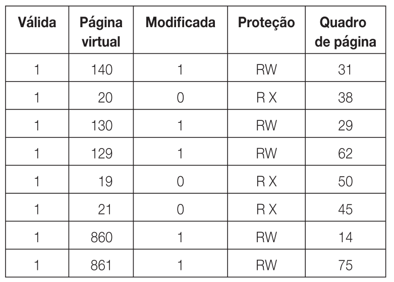

A *memória virtual* é uma técnica na qual o disco é usado para "aumentar" o tamanho da memória principal *(RAM)*. Essa técnica permite um compartilhamento mais seguro e eficiente da memória entre múltiplos programas sendo executados "ao mesmo" tempo. Vale destacar que a memória virtual não é implementada apenas em nível de *hardware*, mas também de *SO*, pois é necessário ter conhecimento sobre o sistema de arquivos do disco. Um exemplo de memória virtual é a partição *Swap* em sistemas *Linux*.

# Paginação
A ideia básica da memória virtual é dividir o *espaço de endereçamento* de cada processo em blocos chamados de **páginas**. Cada página possui sua sequência de endereços mapeada na memória física. A ideia é que nem todas as páginas precisam estar carregadas na memória ao mesmo tempo, elas podem ser trazidas do disco sob demanda. O tamanho do espaço de endereços de um processo é múltiplo do tamanho de uma página.
As páginas virtuais de memória são mapeadas para endereços físicos através dos *quadros de página*. As transferências do disco para a memória principal são feitas com páginas inteiras, ou seja, sempre que seja necessário referenciar um endereço que não está mapeado na memória principal, a página virtual inteira que contém aquele endereço é carregada para a memória principal (geralmente substituindo outra página que não foi utilizada recentemente).

Quando um programa referencia um endereço lógico que não está mapeado na memória principal, ocorre uma interrupção chamada de *page fault* (falta de página). Essa interrupção desvia o controle para o sistema operacional, que então escolhe um quadro de página da memória principal pouco usado e salva seu conteúdo em disco para então sobrescrevê-lo na memória com o conteúdo trazido do disco (a página virtual que contém o endereço referenciado pela instrução que gerou a interrupção).

# Tabela de páginas
A "tradução" dos endereços  virtuais em endereços físicos é feita por um módulo da *CPU* chamado *Memory Management Unit (MMU)*, que controla tanto a memória virtual quando a [[Memória cache|memória cache]]. Para efetivamente traduzir os endereços, utiliza-se uma *tabela de páginas*, que associa os endereços virtuais aos endereços físicos. O endereço virtual é dividido em um *número de página virtual* nos bits mais significativos e um *deslocamento* (que indica o endereço relativo ao início da página virtual) nos bits menos significativos.

Cada entrada em uma tabela de páginas apresenta algumas informações importantes. O campo mais importante é o *número do quadro de página*, pois ele identifica a página virtual à qual aquela entrada se refere. Outro campo importante é o bit que indica se a entrada é válida, isto é, se ela está carregada na memória principal. Se o valor desse bit for `0`, então a página virtual à qual a entrada se refere não está atualmente carregada na memória.

Os bits de proteção indicam as permissões de acesso àquela página virtual, geralmente indicando escrita e leitura. É armazenado também um bit que indica se a página foi alterada na memória principal, ele é útil para decidir se é necessário atualizar a página armazenada no disco. Outro bit importante é aquele que indica se a página está sendo referenciada, seu valor é usado principalmente pelos algoritmos de substituição de página, pois é mais vantajoso substituir páginas que não estão sendo utilizadas na memória principal.

## TLB (memória associativa)
Veja que nesse processo de tradução de endereços virtuais as páginas sempre são acessadas através da memória principal, e isso pode comprometer o desempenho geral do sistema. Afim de acelerar o processo de paginação, é comum implementar em nível de hardware um mecanismo para mapear endereços virtuais para endereços físicos, eliminando a necessidade de referenciar as tabelas de página na memória principal para então mapear seu endereço. Esse mecanismo é chamado de *TLB (Translation Lookaside Buffer)*, ou *memória associativa*. Geralmente a *TLB* é implementado dentro da *MMU*, e consiste em um pequeno número de entradas que contém as informações sobre uma página virtual.

Quando um endereço virtual chega na *MMU*, primeiro é verificado se a página que correspondente já está na *TLB*. Caso a página esteja presente, a tradução de endereço é feita diretamente, sem necessidade de consultar a memória principal. Caso a página não esteja presente na *TLB*, ela é trazida da tabela de páginas da memória e então armazenada na *TLB* para acelerar as consultas futuras.
