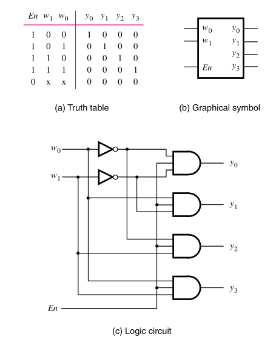
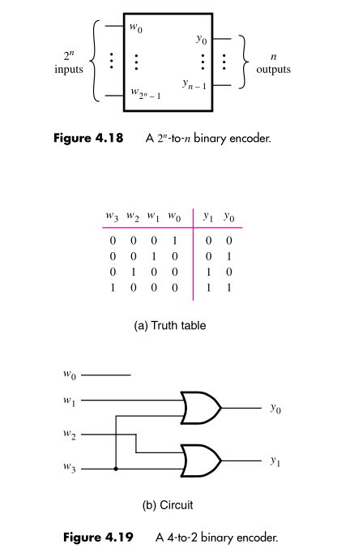

:PROPERTIES:
:ID: 21ae386f-3c92-4233-b672-06c5a03f6210
:END:
#+title: Encoders and decoders

* Decoders
Decoders are circuits that have inputs valuated to assert only one of the multiple outputs at a time. Usually decoders have a enable input, that enables or disables the decodification of the signal.

#+attr_org: :width 300

* Encoders
Encoders perform the opposite function of decoders, they encode data in a more compact form.

#+attr_org: :width 300

