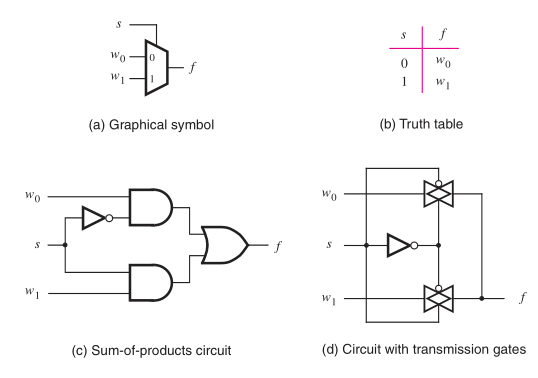

:PROPERTIES:
:ID: 7df44724-50a7-4711-b3e8-85b228eb3bae
:END:
#+title: Multiplexer

A multiplexer is a very common kind of circuit that has a number of inputs, selectors and one output. The idea is that the selectors determine which values of the inputs will be sent to the output. In the image we are presented to different representations of a simple multiplexer circuit.

#+attr_org: :width 500

