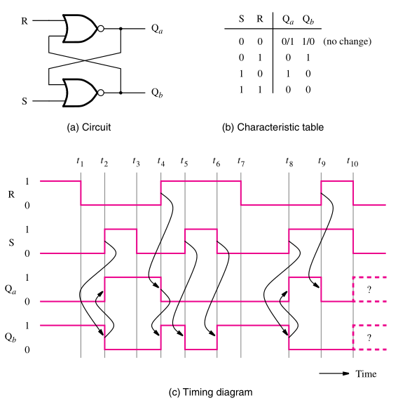
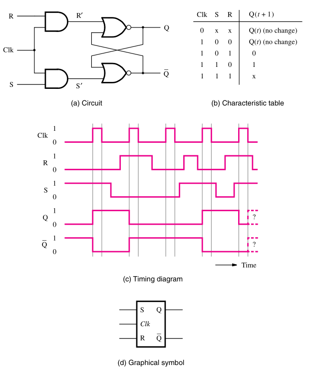
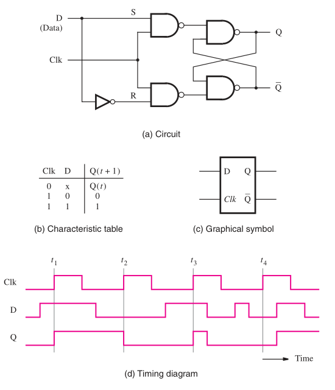

:PROPERTIES:
:ID: 4f33c7ad-e863-404d-b011-eb7793459a48
:END:
#+title: Latches

Latches are the base structures that allows circuits to store information, there are several implementations of latches. The main idea is that a latch recieves two inputs: /Set/ and /Reset/. The circuit is implemented in a way that when both inputs are \(0\), last stated is maintained with no change.

* Basic Latch
:PROPERTIES:
:ID:       7379c68d-b918-43a2-9582-25841947fa85
:END:
This is the core structure of every latch, here we have the basic behavior. It's important to note that when both inputs are equal to \(1\) we can't predict the behavior of the circuit. This implementation is not very useful by itself, since we can't predict when the state of the circuit will change.

#+attr_org: :width 400

* Gated SR Latch
:PROPERTIES:
:ID:       6505e199-e9f2-478a-b80c-61bec3b1def1
:END:
With this type of latch we can enable or disable the circuit with a control signal, denoted as /Clk/. When \(Clk = 0\) the inputs are always \(0\), thus the state of the circuit is maintained. When \(Clk = 1\) the circuit behaves in the same way as the basic latch.

#+attr_org: :width 400

* Gated D Latch
:PROPERTIES:
:ID:       d075714a-a86f-4dcc-878d-9c5d2cdf9413
:END:
This latch simplifies the previous latches, instead of two inputs (S and R) we now have only one input D (Data). One very useful application of this type of latch is in adder/subtractor units, where we have to store the bits of the result.

#+attr_org: :width 400

* Propagation Delay
One key factor to consider is that in real applications, there is a propagation delay to the signals inside a circuit. Therefore, in a latch we can sometimes have situations were the input signals change at the same time as the /Clk/ signal. This could cause unpredictable results and lost of the input signal. In the image we can see represented in the diagram the time frame in which the input signal has to be /stable/ in order to make sure that de propagation delay will not mess up the signal.

#+attr_org: :width 400
[[file:attachments/propagationdelay.png]]

This created the need for a type of circuit that can sync the /Clk/ changes in a way that allows the input signals to always be stable for the change. These circuits are called [[id:860d0638-e241-4bcc-b6a7-1fab58f2ed36][Flip-Flops]].
