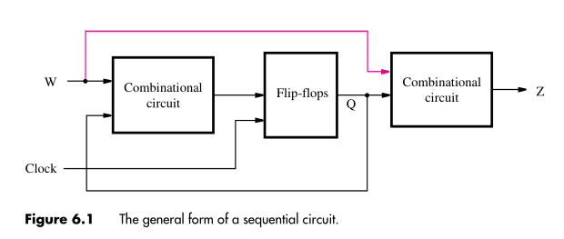

:PROPERTIES:
:ID: b1e8ff6d-8a21-4a9c-ae1b-6d1ddb84bd6f
:END:
#+title: Sequential circuits

Sequential circuits are a class of digital circuits in which the output values depends not only on the input values but also on the past *state* of the circuit. This circuits utilize storage elements that store the values of logic signals.

#+attr_org: :width 500

There are two approaches when designing sequential circuits:

- *Moore type*: circuits whose outputs depend *only on the state* of the circuit are called of /Moore type/
- *Mealy type*: circuits whose outputs depend *on both the state and the primary inputs* are called /Mealy type/

These circuits /can/ be represented in a more abstract way by [[id:192a60c8-c700-4145-8a73-367bc1599eee][finite state machines]].
