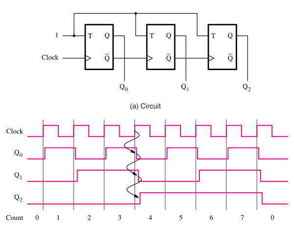
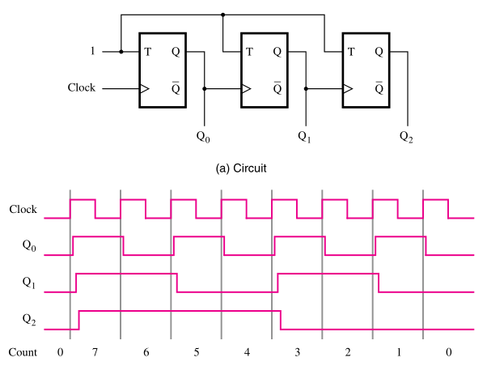
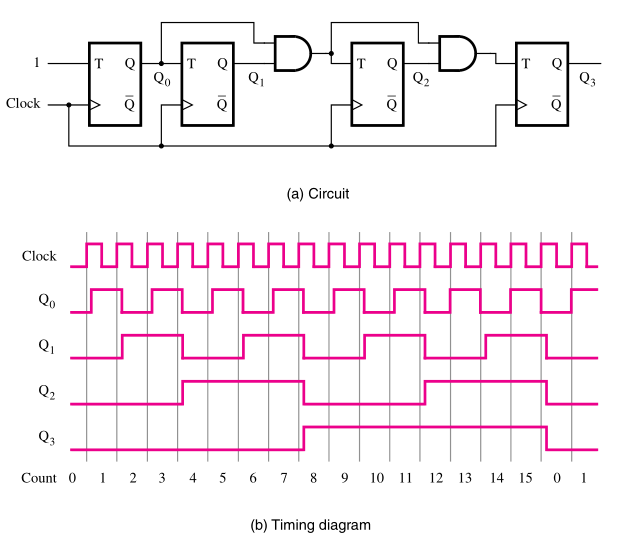
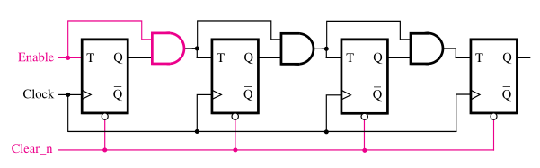
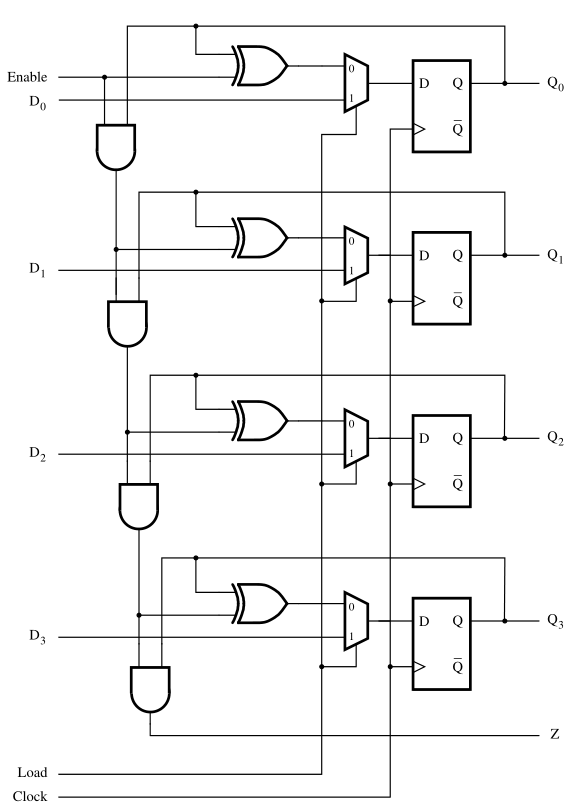
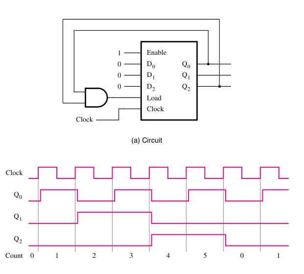
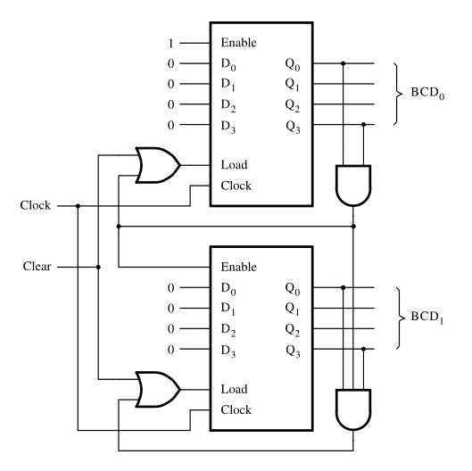

:PROPERTIES:
:ID: 5b18c678-59be-4c72-8296-8a756de6ede9
:END:
#+title: Counters

Counter circuits are very useful for a series of applications. They can be implemented using the [[id:3541d72a-41db-4950-93a1-4814edb16f7d][adder/subtractor]] circuit or with [[id:860d0638-e241-4bcc-b6a7-1fab58f2ed36][flip-flops]]. Since the focus here is to increment or decrement a count by 1, it's much more efficient to use the implementation with flip-flops.

* Asynchronous Counters
:PROPERTIES:
:ID:       778c61e0-facc-483a-b370-4a5082d87441
:END:
The simplest way to implement counters is using T flip-flops. The problem with this implementation is that there is a propagation delay in the circuit.

#+attr_org: :width 400

We can also implement a down-counter using the same elements, but we have to connect the flip-flops in a different way.

#+attr_org: :width 400

* Synchronous Counters
:PROPERTIES:
:ID:       40589602-17f0-4d83-bb1f-ad3aa8b3412f
:END:
In order to solve the propagation delay of the asynchronous counters, we can connect all flip-flops to the same clock. Here we control if the flip-flop will change its state based on the state of the previous flip-flops.

#+attr_org: :width 400

We can implement the ability to enable and clear the counters with the simple addition of the /enable/ and the /clear/ control signals to the flip-flops.

#+attr_org: :width 400

* Counters with Parallel Load
:PROPERTIES:
:ID:       4884eb91-e0f6-4e7c-b443-5591198645cb
:END:
This type of counters allow us to start the count with an arbitrary external value. Here we implement a synchronous counter with [[id:2f5a86a8-e086-474b-8388-22a4e9ed06c4][D flip-flops]] and [[id:7df44724-50a7-4711-b3e8-85b228eb3bae][multiplexers]]. We also have to add the control input $Load$. When \(Load=0\) the circuit counts. When \(Load=1\) the circuit loads a new value from the inputs to the flip-flops.

#+attr_org: :width 400

* Reset Synchronization
:PROPERTIES:
:ID:       d11268a8-7e6a-48ea-800c-3b3718c89968
:END:
This type of implementation allow us to reset the count to \(0\) when the count gets to an specific value. Here we use a synchronous counter with parallel load, its parallel load feature is used to reset the counter when the count reaches, in this case, 5.

#+attr_org: :width 400

* BCD Counter
:PROPERTIES:
:ID:       32559f12-8f5b-42b4-a1c5-5642039a196e
:END:
This type of counter is very interesting because it allows us to code the binary count to decimal representation.

#+attr_org: :width 400

