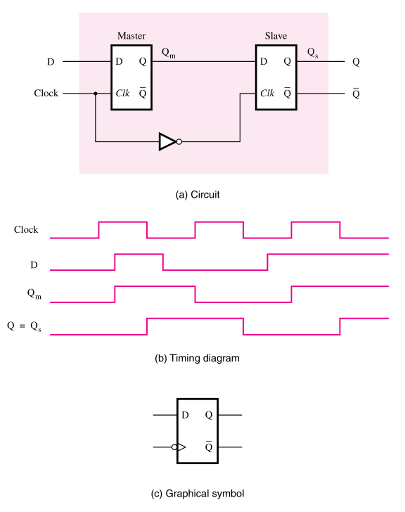
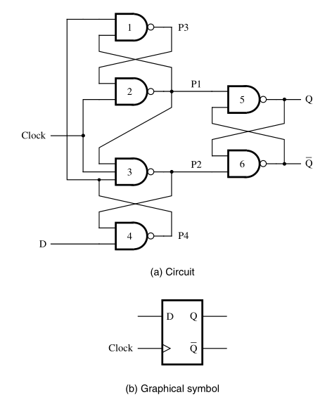
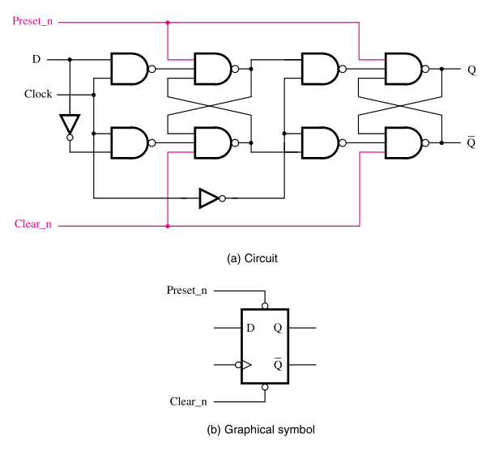
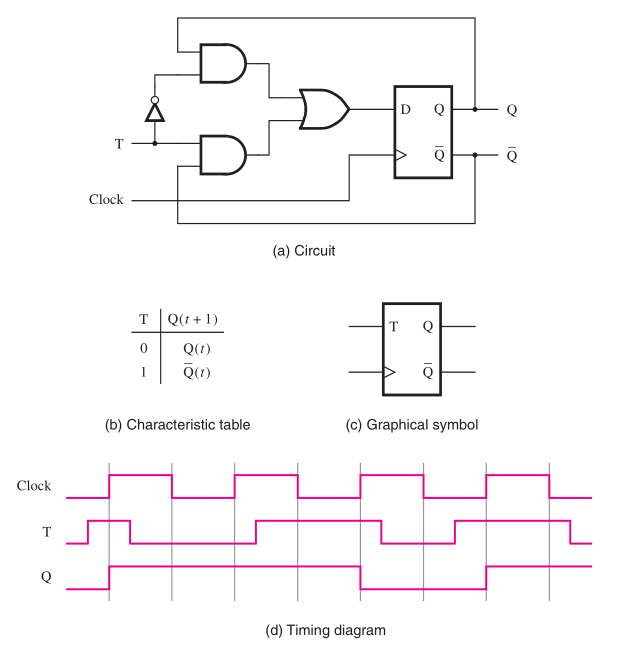
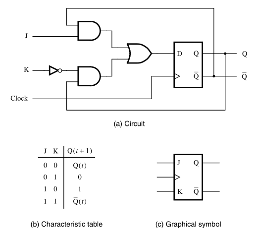

:PROPERTIES:
:ID: 860d0638-e241-4bcc-b6a7-1fab58f2ed36
:END:
#+title: Flip-Flops

Flip-flops have a behavior very similar to [[id:4f33c7ad-e863-404d-b011-eb7793459a48][latches]], but they differ in the sense that in flip-flops, the stored signal can change only once during one clock cycle. Not only that, but the output state can change only on the /edge/ of the clock signal.
If the flip-flop allows state changes only when the clock signal goes from \(0\) to \(1\), we say that it is a /positive-edge-triggered/ flip-flop. If it allows state changes only when the clock signal goes from \(1\) to \(0\), we say that it is a /negative-edge-triggered/ flip-flop.

* Master-Slave D Flip-Flop
:PROPERTIES:
:ID:       2f5a86a8-e086-474b-8388-22a4e9ed06c4
:END:
This way of implementation uses two [[id:d075714a-a86f-4dcc-878d-9c5d2cdf9413][gated D latches]]  that are controlled by the same clock. In this type of circuit the master and slave can never be enabled at the same time. This gives the circuit the characteristic of only changing the output state when the clock goes from \(1\) to \(0\), also called the /negative edge/ of the clock.

#+attr_org: :width 400

There is another implementation of the same circuit that is more cost-effective and uses NAND gates instead of two latches. In this case we have a implementation of a /positive-edge-triggered/ flip-flop. If we needed a /negative-edge-triggered/ flip-flop we would have to implement a similar circuit with NOR gates instead.

#+attr_org: :width 400

* Clear and Preset
:PROPERTIES:
:ID:       a6c511b4-2ec8-4ef4-bf15-10a2fbc8b727
:END:
This type of flip-flops allows two new inputs to change the value of the output without interference of the clock. This kind of implementation can be very useful in a circuit like a counter, where we need to specify a start time and also clear the count.

#+attr_org: :width 400

* T Flip-Flop
:PROPERTIES:
:ID:       77bc34ea-ae4c-4dcb-b497-06fb9c44765f
:END:
The T flip-flop is a simple modification do the D flip-flop. Here we connect the outputs to the inputs of the circuit and control them using a control input \(T\). The circuit maintains the state if \(T=0\), and inverts its state if \(T=1\).

#+attr_org: :width 400

* JK Flip-Flop
:PROPERTIES:
:ID:       8b74a9f1-6fbd-4bab-b21d-b2df79b6fb50
:END:
This type of flip-flop is similar to the previous T flip-flop, but instead of using a single control input, it use two inputs \(J\) and \(K\). With this circuit we can combine the behavior of SR and T flip-flops. It works exactly like a implementation of a [[id:6505e199-e9f2-478a-b80c-61bec3b1def1][gated SR latch]] using flip-flops. But when both input signals are equal to \(1\), instead of having a unpredictable behavior, the circuit toggles its state like the T flip-flop.

#+attr_org: :width 400

