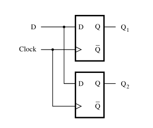
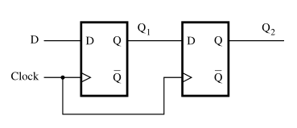

:PROPERTIES:
:ID: E4BCD3C6-E616-4D65-8FDF-9431C8B5D893
:END:
#+title: Non-blocking assignments

In [[id:73012C9B-F3C0-4379-BA84-831AA20E8F1B][Verilog]] we have two type of assignments:

- Blocking assignments: ===
- Non-blocking assignments: =<==

The main difference is that in the blocking assignments the *order matters*, while in the non-blocking assignments the assignments are done *simultaneously*.

To show the difference:

#+begin_src verilog
module example_blocking(D, Clock, Q1, Q2);
    input D, Clock;
    output reg Q1, Q2;
    
    always @(posedge Clock)
    begin
        Q1 = D;
        Q2 = Q1;
    end
endmodule
#+end_src

Produces:

#+attr_org: :width 300

#+begin_src verilog
module example_nonblocking(D, Clock, Q1, Q2);
    input D, Clock;
    output reg Q1, Q2;
    
    always @(posedge Clock)
    begin
        Q1 <= D;
        Q2 <= Q1;
    end

endmodule
#+end_src

Produces:

#+attr_org: :width 300

