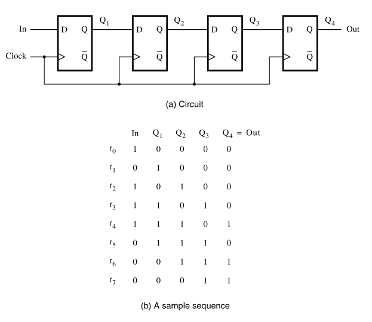
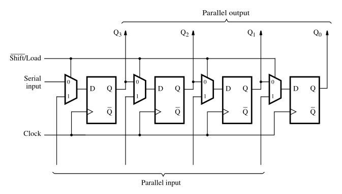

:PROPERTIES:
:ID: 6ca9dde1-6128-4fd1-bd48-a943ca3bfd3b
:END:
#+title: Registers

While [[id:860d0638-e241-4bcc-b6a7-1fab58f2ed36][flip-flops]] store only one bit of information, registers are able to store multiple bits of information. How? Well, registers are basically a set of flip-flops arranged in a way that allows the storage of multiple bits of information.

* Shift Register
This type of register has the ability to shift its contents. This is possible by transferring the state of each flip-flop to the next. This implementation is not very useful because we don't have control of the shifting process.

#+attr_org: :width 400

* Parallel-Access Shift Register
This type of register also has the ability to shift its contents, but it does that in a parallel way. Here we have a control signal \(\overline{Shift}/Load\) that selects the mode of operation. If \(\overline{Shift}/Load=0\), then the circuit operates as a shift register. If \(\overline{Shift}/Load=1\), then the circuit loads the inputs into the register.

#+attr_org: :width 500

