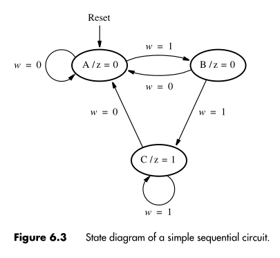
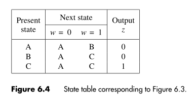

:PROPERTIES:
:ID: fce93cd2-8d92-4cdf-9332-64a590d91efa
:END:
#+title: State diagram and table

These are the first steps do to when designing a [[id:192a60c8-c700-4145-8a73-367bc1599eee][finite state machine]]. They allow us to determine how many states are needed and which transitions are possible from one state to another.
First we define a /starting state/, this is the state that the circuit should enter when power is turned on or when a /reset/ signal is applied. After that we define the other states of the circuit. The following diagram is from a example in the [[file:attachments/Fundamentals_of_Digital_Logic.pdf][book]], and it shows all the possible states of the circuit and the /triggers/ that changes them to another state.

#+attr_org: :width 300

The state table is a more formal and readable way of describing the changes in the state of the circuit:

#+attr_org: :width 300

