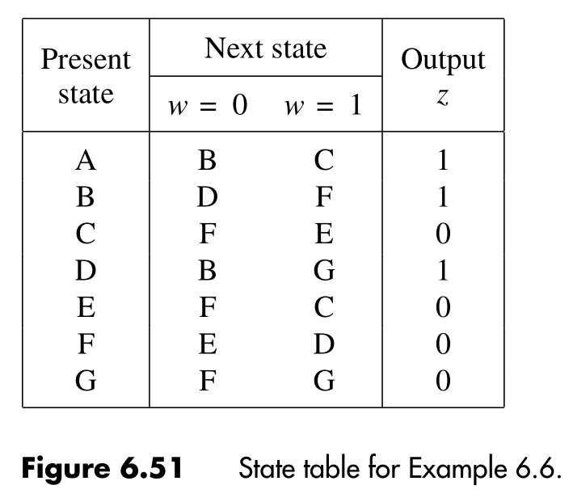
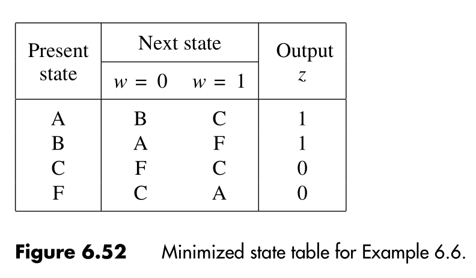

:PROPERTIES:
:ID: 6566fdcf-a1c1-46ec-8e54-e859e9961ecd
:END:
#+title: State minimization

Sometimes when designing more complex /finite state machines/ with various /states/, it's very likely that the initial design will not be as efficient as possible. This usually means that we end up using more states than is actually required, which leads to the use of more flip-flops than is necessary.
To solve this problem we can apply the /partitioning minimization procedure/ to the states of the machine. This procedure consists in grouping the states in /partitions/. A /partition/ consists of one or more equivalent states. We start by dividing the partitions considering the circuit output for each state. Then we divide even more, this time considering the next state for each state in the partitions. Considering following [[id:fce93cd2-8d92-4cdf-9332-64a590d91efa][state table]]:

#+attr_org: :width 400

The steps to minimize the states are the followings:

\begin{aligned}
P_1&=(ABD)(CEFG)\\
P_2&=(ABD)(CEG)(F)\\
P_3&=(AD)(B)(CEG)(F)\\
P_4&=P_3
\end{aligned}

So, we can represent the same circuit using only \(4\) states, instead of the initial \(7\). The resulting table looks like that:

#+attr_org: :width 400

