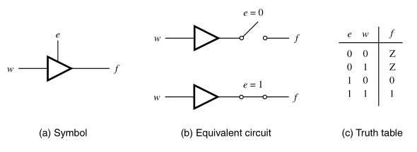
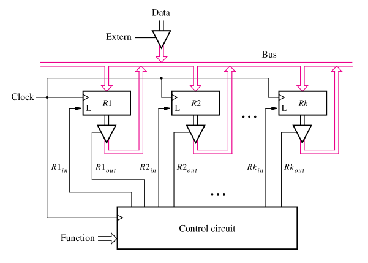
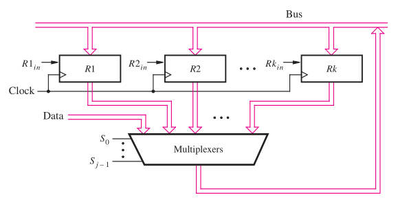

:PROPERTIES:
:ID: 95e22236-d77f-4b59-ab0c-97a3c3a229ed
:END:
#+title: Bus structure

Usually more complex digital circuits have a /datapath circuit/, which is used store and manipulate data, and a /control circuit/ (usually implemented via [[id:192a60c8-c700-4145-8a73-367bc1599eee][finite state machines]]), that controls the operation of the data path circuit. A bus is a structure that can interconnect multiple parts of a circuit using the same set of wires. Bus structures create a common path to transfer data from multiple sources to multiple destinations, for that reason it's necessary to ensure that only one source is active at a time, to prevent interference.

* Tri-state drivers
Tri-state drivers are simple buffers that can propagate the sign of the input to the output, without performing any logic operation. The idea here is that these drivers recieve a /enable/ signal, that allows us to disable the connection when needed. When the connection is disabled, the output enters in a /high impedance state/, that is denoted by the letter \(Z\) (or \(z\)).

#+attr_org: :width 400

This type of connection allows us to control which connections will be active in the bus. A circuit using a bus that implements this tri-state drivers idea can look like that:

#+attr_org: :width 400

* Multiplexers
We can also control the connections on the bus using [[id:7df44724-50a7-4711-b3e8-85b228eb3bae][multiplexers]] to select which source of data will be active.

#+attr_org: :width 400

