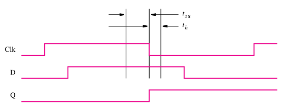

:PROPERTIES:
:ID:       a6be1dd8-a863-484f-bc34-6334be627728
:END:
#+title: Propagation delay

One key factor to consider is that in real applications, there is a propagation delay to the signals inside a circuit. Therefore, in a latch we can sometimes have situations were the input signals change at the same time as the /Clk/ signal. This could cause unpredictable results and lost of the input signal. In the image we can see represented in the diagram the time frame in which the input signal has to be /stable/ in order to make sure that de propagation delay will not mess up the signal.

#+attr_org: :width 400

This created the need for a type of circuit that can sync the /Clk/ changes in a way that allows the input signals to always be stable for the change. These circuits are called [[id:860d0638-e241-4bcc-b6a7-1fab58f2ed36][Flip-Flops]].
