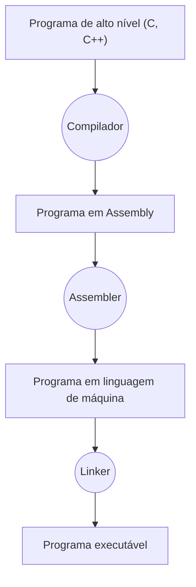

# Assembly
A linguagem *Assembly (Montagem)* é uma linguagem de baixo nível, muito próxima do hardware. A ideia da linguagem é fornecer um nome simbólico (e mais legível para seres humanos) para cada instrução do hardware, facilitando o desenvolvimento de programas.
Para que um programa com instruções em Assembly possa ser de fato executado pelo computador, ele passa por um *Assembler (Montador)*, que "traduz" as instruções simbólicas e as variáveis para os devidos códigos de instruções e endereços de memória, gerando um programa executável.
Vale lembrar que, por ser uma linguagem muito próxima do hardware, um programa em Assembly depende diretamente d representação dos conjuntos

Nesse processo, o *Linker* é responsável por importar e gerenciar bibliotecas externas utilizadas no programa.

---

created: 01/03/2021
modified: 01/03/2021