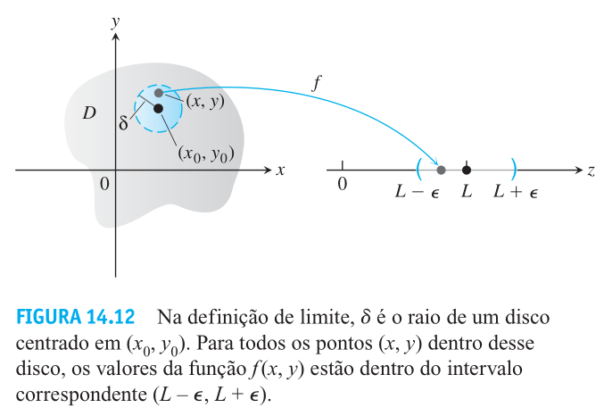

# Limite de funções de várias variáveis
O conceito de limite aplicado para funções de várias variáveis é muito similar ao conceito de limite para funções de uma variável, porém com a introdução de novas variáveis são introduzidas também novas dificuldades e uma complexidade adicional na manipulação desses conceitos.
Seja $f: A \subset \mathbb{R}^2 \to \mathbb{R}$ uma função, $(x_0, y_0)$ um ponto de acumulação de $A$ e $L \in \mathbb{R}$, temos
$$
    \lim_{(x,y) \to (x_0, y_0)}{f(x,y)} = L
$$
se e somente se para todo $\epsilon > 0$ existe $\delta > 0$ tal que, para todo $(x,y) \in D_f$, $0 < ||(x,y) - (x_0, y_0)|| < \delta \implies |f(x,y) - L| < \epsilon$.

As propriedades dos limites das funções de várias variáveis são semelhantes àquelas presentes nos limites de funções de uma variável. Dados três números reais $L$, $M$, $k$, e um número inteiro positivo $n$ tal que:

$$
\lim_{(x,y) \to (x_0, y_0)}{f(x,y)} = L \qquad \text{e} \qquad\lim_{(x,y) \to (x_0, y_0)}{g(x,y)} = M
$$

- Regra da soma: $\displaystyle\lim_{(x,y) \to (x_0, y_0)}{(f(x,y) + g(x,y))} = L + M$
- Regra da diferença: $\displaystyle\lim_{(x,y) \to (x_0, y_0)}{(f(x,y) - g(x,y))} = L - M$
- Regra da multiplicação por constante: $\displaystyle\lim_{(x,y) \to (x_0, y_0)}{(k \cdot f(x,y))} = kL$
- Regra do produto: $\displaystyle\lim_{(x,y) \to (x_0, y_0)}{(f(x,y) \cdot g(x,y))} = L \cdot M$
- Regra do quociente: $\displaystyle\lim_{(x,y) \to (x_0, y_0)}{\frac{f(x,y)}{g(x,y)}} = \frac{L}{M}$, $M \neq 0$
- Regra da potência: $\displaystyle\lim_{(x,y) \to (x_0, y_0)}{[f(x,y)]^n} = L^n$
- Regra da raiz: $\displaystyle\lim_{(x,y) \to (x_0, y_0)}{\sqrt[n]{f(x,y)}} = \sqrt[n]{L}$, se $n$ for par, assume-se que $L > 0$

Um ponto importantíssimo é o de que, assim como nas funções de uma variável os limites laterais devem ter o mesmo valor para que o limite exista, nas funções de várias variáveis, quando um limite existe em um ponto, o limite deve ser o mesmo ao longo de todos os (infinitos) caminhos pelos quais é possível de aproximar do ponto. Dessa observação se deriva um importantíssimo teorema que nos permite determinar se o limite de uma função não existe. Note que não é possível determinar com certeza que o limite de uma função de várias variáveis existe, pois isso implica em testar o limite da função por todos os infinitos caminhos pelos quais é possível se aproximar do ponto.

> Se uma função $f(x,y)$ tem limites diferentes ao longo de dois caminhos diferentes no domínio de $f$ quando $(x,y)$ se aproxima de $(x_0, y_0)$, então $\displaystyle\lim_{(x,y) \to (x_0, y_0)}{f(x,y)}$ não existe.

## Continuidade
Assim como para funções de uma variável, a continuidade é definida em termos de limites.
Uma função $f(x,y)$ é **contínua no ponto** $(x_0, y_0)$ se as seguintes condições forem satisfeitas:

1. $f$ for definida em $(x_0, y_0)$
2. $\displaystyle\lim_{(x,y) \to (x_0, y_0)}{f(x,y)}$ existe
3. $\displaystyle\lim_{(x,y) \to (x_0, y_0)}{f(x,y)} = f(x_0, y_0)$
