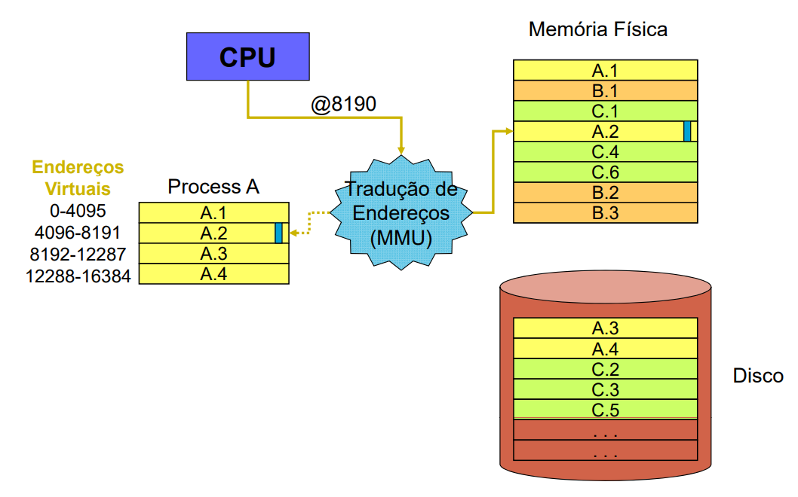
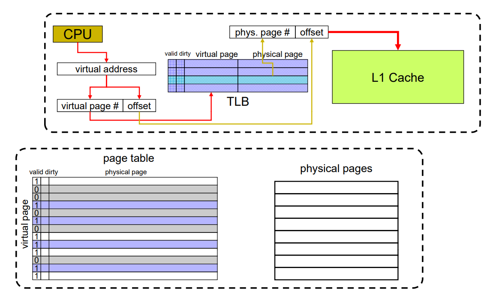

# Memória virtual
A *memória virtual* é uma técnica na qual o disco é usado para "aumentar" o tamanho da memória principal *(RAM)*. Essa técnica permite um compartilhamento mais seguro e eficiente da memória entre múltiplos programas sendo executados "ao mesmo" tempo. Vale destacar que a memória virtual não é implementada apenas em nível de *hardware*, mas também de *SO*, pois é necessário ter conhecimento sobre o sistema de arquivos do disco. Um exemplo de memória virtual é a partição *Swap* em sistemas *Linux*.

## Paginação
A ideia básica da memória virtual é dividir o *espaço de endereçamento* de cada processo em blocos chamados de **páginas**. Cada página possui sua sequência de endereços mapeada na memória física. A ideia é que nem todas as páginas precisam estar carregadas na memória ao mesmo tempo, elas podem ser trazidas do disco sob demanda. O tamanho do espaço de endereços de um processo é múltiplo do tamanho de uma página.
As páginas virtuais de memória são mapeadas para endereços físicos através dos *quadros de página*. As transferências do disco para a memória principal são feitas com páginas inteiras, ou seja, sempre que seja necessário referenciar um endereço que não está mapeado na memória principal, a página virtual inteira que contém aquele endereço é carregada para a memória principal (geralmente substituindo outra página que não foi utilizada recentemente).

Quando um programa referencia um endereço lógico que não está mapeado na memória principal, ocorre uma interrupção chamada de *page fault* (falta de página). Essa interrupção desvia o controle para o sistema operacional, que então escolhe um quadro de página da memória principal pouco usado e salva seu conteúdo em disco para então sobrescrevê-lo na memória com o conteúdo trazido do disco (a página virtual que contém o endereço referenciado pela instrução que gerou a interrupção).
O mecanismo de memória virtual deve garantir a proteção de memória, ou seja, garantir que um processo não leia ou escreva dados no espaço de endereços de outro processo. Isso é feito por meio de um mecanismo de *tradução de endereços*.

## Tradução de endereços
Para a implementação de um mecanismo de tradução de endereços, é necessário introduzir um nível adiciona de endereçamento, chamado de **endereço virtual**. Cada processo tem um espaço de endereços virtuais **únicos**, que são independentes do endereço físico real. Antes da execução do processo, seus endereços virtuais são traduzidos em endereços físicos.
Essa tradução é feita por um módulo da *CPU* chamado *Memory Management Unit (MMU)*, que controla tanto a memória virtual quando a [[Memória cache|memória cache]].

Para efetivamente traduzir os endereços, utiliza-se uma *tabela de páginas*, que associa os endereços virtuais aos endereços físicos.

Veja que nesse processo de tradução as páginas sempre são acessadas através da memória principal, e isso pode comprometer o desempenho geral do sistema.
Para otimizar o processo de tradução de endereços, é implementada uma [[Memória cache|memória cache]], chamada de *Translation Lookup Buffer (TLB)*, para armazenar exclusivamente os endereços virtuais e a tradução correspondente. Com a introdução dessa nova memória cache, é necessária a implementação de novas políticas para gerenciar o seu acesso:

---

created: 03/06/2021
