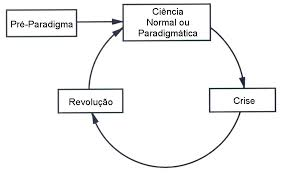

# Revoluções científicas
[[Thomas Kuhn]] desenvolveu o conceito de *revoluções científicas* para descrever a forma como a ciência opera e se desenvolve. Vale notar que, ao contrário do que ocorre com o [[Falseabilismo]] de [[Karl Popper]], a abordagem de Kuhn é muito mais **descritiva** do prescritiva, e se baseia muito mais em investigações históricas do que na lógica pura.

Kuhn introduz com sua teoria a noção de *paradigmas* segundo os quais uma ciência opera em um determinado período, bem como o conceito de *revoluções científicas* processos pelos quais se dá a troca de paradigmas em uma área do conhecimento. Segundo Kuhn, a ciência se divide em períodos de ciência normal e ciência revolucionária. A transição entre esses períodos forma um ciclo que, para Kuhn, é o motor do desenvolvimento da ciência.

## Período pré-paradigma
O período pré-paradigma compreende o período de início de uma nova área de pesquisa. Caracterizado pela constante competição entre várias "escolas" do conhecimento, esse período não apresenta um paradigma estabelecido.

## Ciência normal
    Ciência praticada na maior parte do tempo, o "dia a dia" do cientista. Nesse período o foco não são novas descobertas ou revoluções na determinada área do conhecimento, mas sim a articulação do paradigma e a condução de experimentos (cujo resultado já é esperado e previsto pelo paradigma) dentro do mesmo. Nesse período se dá grande parte do desenvolvimento e aperfeiçoamento da teoria do paradigma.

## Anomalias e crises
Anomalias não implicam em uma crise. A crise se instaura apenas quando as anomalias se tornam tão frequentes ou graves em uma determinada área que começam a perturbar o processo de ciência normal, minando a confiança dos cientistas no paradigma em que estão inseridos.

## Revoluções científicas

## Noção de progresso
A noção de progresso na ciência geralmente é de algo linear a acumulativo, e de fato é conveniente que seja assim. Entretanto, para Kuhn o progresso da ciência não se dá de forma linear, e sim através das revoluções científicas, períodos conturbados e que resultam em uma total mudança na visão de mundo dos pesquisadores da área.

---

created: 03/11/2021
