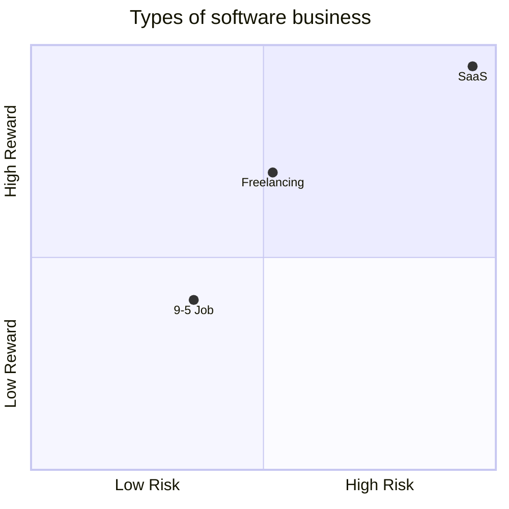

This year I started thinking a lot about going **freelance or creating a business**. For me, the fundamental flaw in a traditional employee work contract is that with a fixed salary I simply **lack the incentive** to become better at my job. Besides that, "being your own boss" gives you way **more freedom** to live life in general (that is not to say that it is easy or less work).

I did a bit of freelancing in Upwork, and it was a very nice experience. I also started thinking about doing some sort of SaaS, maybe to sell it as a product or maybe just to host it on my [[Homelab]].

While doing that, I became to realize that doing a SaaS is actually much more than just coding. The **marketing and business** part of a product are actually more important than the engineering itself. Since I'm mostly an [[Software development|developer]] and what gives me joy is the act of building stuff, maybe a SaaS or a software product in general is not the way to go right now.

With a SaaS you have an almost unlimited ceiling of how much money you can make, and therefore it is an extremely scalable business. On the other hand, it is also extremely difficult to build a successful SaaS, and therefore it is an **extremely risky** business. With freelancing, you have a **lower ceiling** of how much money you can make, but it is a significantly **lower risk** business than starting a product company.

The way I think about this concept is the following:

- A 9-5 job is the **safest** option (but not safe by any means, as you can always be fired in layoffs caused by bad market moments), but also the one that has the **lower ceiling** and the least amount of freedom.
- A SaaS or product company is the **riskiest** option but also the one with the **highest ceiling**. It is worth to keep in mind that you also have to become good at several different skills besides engineering itself.
- The Freelancing route has **similar risk than a 9-5** job but also a much **higher ceiling**. Besides that, I consider it the one with the most amount of **freedom** because you can just slow down on taking new contracts or stop altogether for a few weeks, something that is not possible in a 9-5 or a product company.

# References

https://www.youtube.com/watch?v=Acj6hrfZeVg
