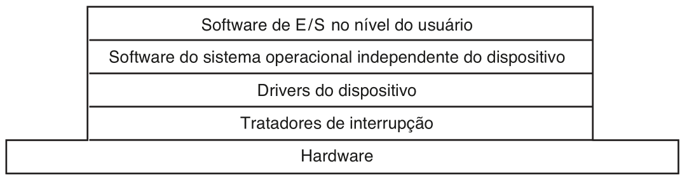

# Software de IO
O principal objetivo do software de IO é fornecer uma **interface uniforme** de interação com os dispositivos, ou seja, não importa o tipo ou os detalhes de implementação do dispositivo, o usuário deve ser capaz de interagir com ele da mesma maneira que interage com outro dispositivo, com uma implementação totalmente diferente. Um exemplo disso está presente nos sistemas *UNIX*, onde é possível interagir com os discos da mesma forma que com pendrives ou outros dispositivos, basta que eles estejam montados no sistema de arquivos.

## Métodos de implementação
As operações de IO geralmente consistem na escrita ou leitura para um dispositivo externo. Essas operações são relativamente mais lentas do que velocidade de processamento de instruções da CPU, portanto é necessário algum mecanismo para otimizar essas operações sem desperdiçar mais tempo de CPU do que o necessário.
Tendo isso em vista, existem diferentes formas de se implementar essas operações, e as três principais alternativas são apresentadas aqui.

### Programado
Essa forma de implementação é simples e consiste em deixar a CPU realizando todo o trabalho de IO. Quando um processo de usuário faz alguma chamada de IO, o sistema operacional primeiro verifica se o dispositivo está disponível no momento, e se esse não for o caso, o processo é bloqueado. Caso o dispositivo esteja disponível, o sistema operacional se encarrega de fazer a operação desejada, e se mantém nessa operação até que ela seja concluída. A ideia é utilizar um comportamento de *busy waiting* para manter a CPU verificando os registradores do dispositivo e enviando ou recebendo dados até que a operação seja concluída.
A desvantagem evidente desse método é que a CPU deve ficar ocupada aguardando as operações dos dispositivos de IO, que geralmente são lentas o bastante para que esse método se torne um grande desperdício de tempo de CPU.

### Orientado a interrupções
Nesse método, ao invés da CPU ficar aguardando a conclusão da operação do dispositivo de IO, o sistema operacional chaveia o contexto de execução e passa para outra tarefa. Nesse ponto, cabe ao dispositivo de IO gerar uma interrupção para avisar a CPU que a operação foi concluída. A vantagem dessa implementação é que ela elimina a necessidade de *busy-waiting*, e permite um melhor uso da CPU. Entretanto, interrupções ainda assim são caras para o sistema, e se forem muito frequentes podem acabar por comprometer significativamente o desempenho pela troca constante de contexto.

### Usando DMA
Essa forma de implementação se baseia no uso de acesso direto à memória (DMA). A ideia é que a CPU se comunica com o controlador de DMA ao invés de interagir diretamente com o dispositivo. Dessa forma, o DMA pode cuidar de todo o trabalho da operação, fazendo uma interrupção apenas para notificar que a operação toda foi concluída. Isso reduz significativamente o número de interrupções necessárias e deixa a CPU livre para executar outras tarefas. Na maioria dos casos essa é uma boa alternativa, porém a complexidade e custo adicionais do controlador de DMA são detalhes a serem considerados na implementação.

## Camadas de software
O software de IO geralmente é organizado em camadas com funções e níveis de abstração bem definidos. A função de cada camada pode variar de sistema para sistema, mas ainda assim e ideia geral de funcionamento e relação entre as camadas se mantém.

## Tratadores de interrupção
Os tratadores de interrupção compõe a camada mais baixa do software de IO. As rotinas de interrupção devem fazer os ajustes necessários no sistema para que o driver que fez a chamada bloqueante que gerou a interrupção seja novamente colocado em execução. Esse processo geralmente envolve uma troca de contexto do sistema operacional e o ajuste de áreas de memória e valores de registradores.

## Drivers dos dispositivos
Os drivers de dispositivo são programas (geralmente implementados no núcleo do sistema operacional) para controlar algum dispositivo específico de IO. É comum que os drivers de um dispositivo sejam fornecidos para diversos sistemas operacionais pelo fabricante do mesmo. Geralmente os drivers são capazes de lidar com um tipo específico de dispositivos relacionados, isso ocorre pelo fato dos drivers interagirem diretamente com os controladores dos dispositivos, que podem variar muito de acordo com o tipo do dispositivo.

Apesar das especificidades de cada controlador, existem casos nos quais é possível usar diversas camadas de drivers para reutilizar algum driver referente a alguma tecnologia comum entre uma classe de dispositivos. Um bom exemplo disso são os dispositivos USB. Apesar de poderem ter aplicações completamente distintas, os dispositivos USB compartilham da mesma tecnologia de barramento serial. Tendo isso em vista, é possível implementar drivers mais específicos para cada tipo de dispositivo que operam em cima dos drivers de comunicação USB. Dessa forma, é possível reaproveitar a implementação comum aos dispositivos, diferindo apenas na implementação das operações específicas de cada tipo de dispositivo.

## Software independente de dispositivo
Essa camada é composta pela parte do software de IO que não é específica para nenhum dispositivo, geralmente lidando com operações de mais alto nível, sem interação direta com controladores de dispositivo.. O objetivo principal dessa camada é realizar as operações de IO que são comuns a todos os dispositivos e, principalmente, oferecer uma interface uniforme para o software no nível do usuário.

---

created: 26/10/2021
