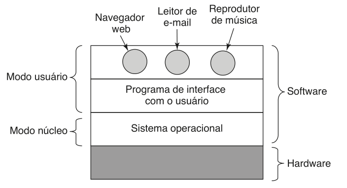

:PROPERTIES:
:ID: 5a9a4a54-891c-4367-8cc3-46ae1410f86f
:END:
#+title: Sistemas operacionais

* Sistemas operacionais
Computadores modernos são sistemas complexos, consistindo muitas vezes em vários processadores, diferentes tipos de memórias e muitos dispositivos de /IO/. É evidente que os componentes de hardware são complexos e as vezes apresentam implementações muito específicas, nesse contexto os sistemas operacionais são essenciais para fornecer abstrações e recursos que possibilitam uma utilização mais eficiente do sistema computacional.

#+begin_quote
Um sistema operacional é um programa (ou conjunto de programas) interrelacionados cuja funcionalidade é: 1. Fornecer uma *camada de abstração* para as aplicações interagirem com o hardware 2. *Gerenciar* e alocar os recursos disponíveis no sistema computacional.

#+end_quote

